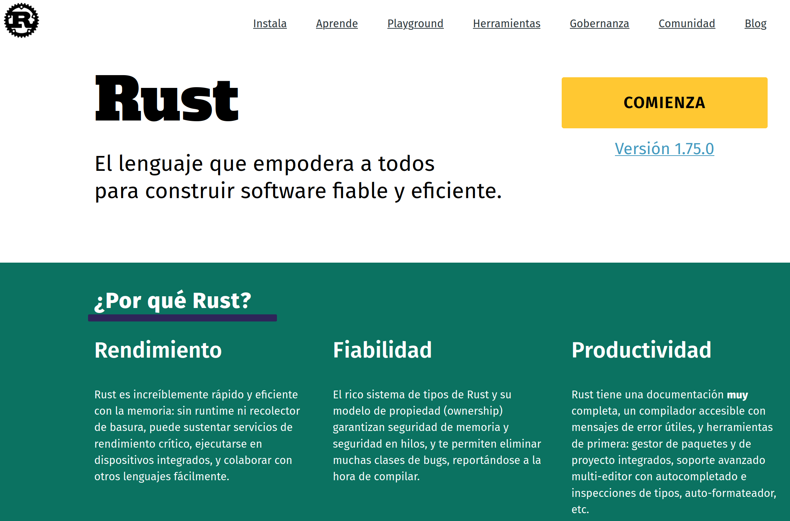
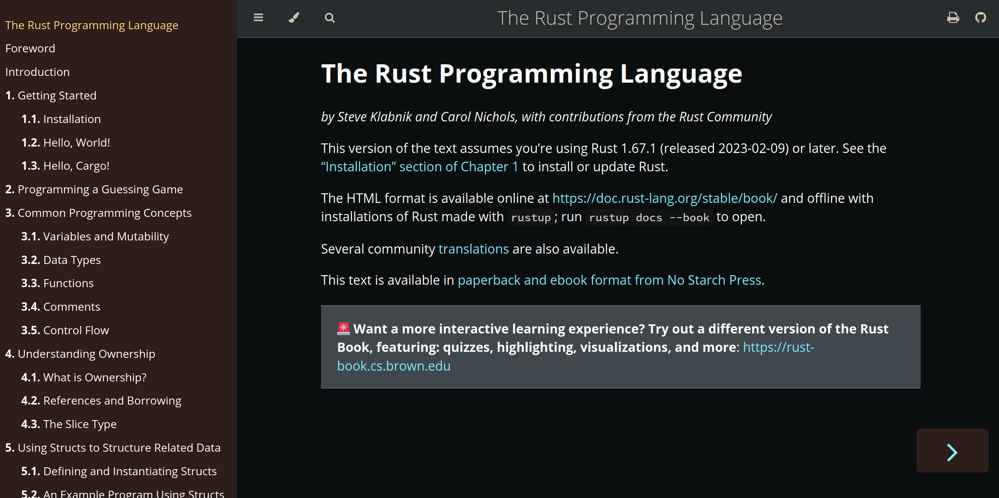
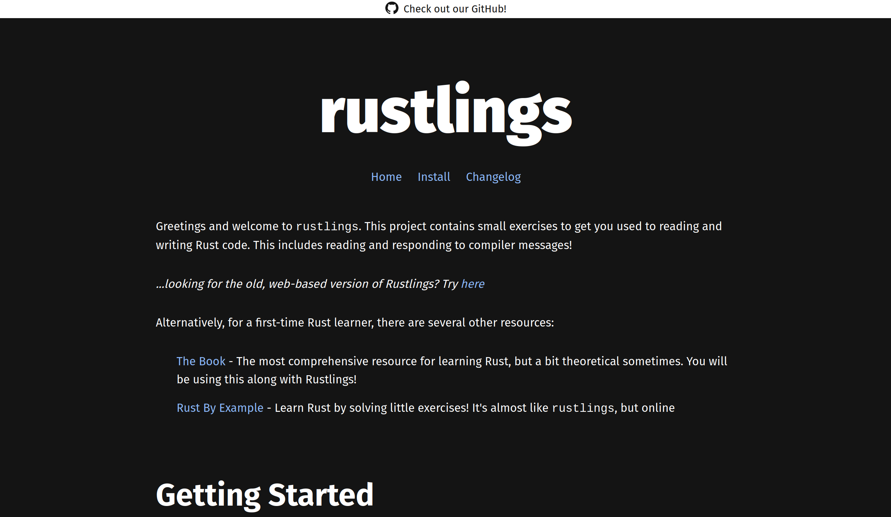

# Por qué Rust?

- # Recursos Online
	- https://www.rust-lang.org/
	  
	- https://doc.rust-lang.org/book/
	  
	- https://rustlings.cool/
	  
- # Creando un proyecto con `cargo`
	- ```shell
	  # https://www.rust-lang.org/es/learn/get-started
	  $ curl --proto '=https' --tlsv1.2 -sSf https://sh.rustup.rs | sh
	  $ cargo --version
	  cargo 1.75.0 (1d8b05cdd 2023-11-20)
	  ```
	- ```shell
	  $ cargo new aprendiendo-rust
	  ```
	- ```shell
	  $ tree
	  .
	  ├── Cargo.toml
	  └── src
	      └── main.rs
	  ```
	- ```rust
	  // src/main.rs
	  fn main() {
	      println!("Hello, world!");
	  }
	  ```
	- ```shell
	  $ cargo run
	     Compiling aprendiendo-rust v0.1.0 (/...)
	      Finished dev [unoptimized + debuginfo] target(s) in 0.43s
	       Running `target/debug/aprendiendo-rust`
	  Hello, world!
	  ```